# Claude Code と Codex の連携ドキュメント

Claude CodeとCodex CLIの協業フロー、アーキテクチャ、ベストプラクティスを解説する。

## 📚 目次

1. [概要](#概要)
2. [アーキテクチャ](#アーキテクチャ)
3. [役割分担](#役割分担)
4. [3つのレビューフェーズ](#3つのレビューフェーズ)
5. [実装詳細](#実装詳細)
6. [使い方ガイド](#使い方ガイド)
7. [ベストプラクティス](#ベストプラクティス)
8. [トラブルシューティング](#トラブルシューティング)

---

## 概要

### Claude CodeとCodexの協業の目的

Claude Codeは**実装とコード修正**を担当し、Codexは**調査・分析・検証**を担当する。これにより開発の品質と効率が向上する。

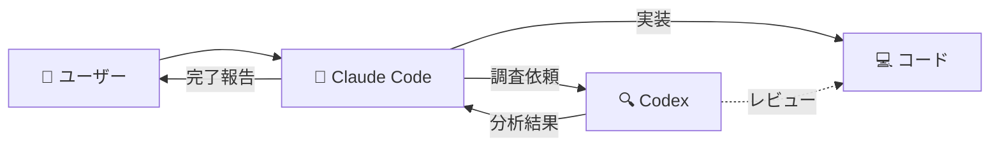

### 主要な利点

- **品質向上**: AIによる客観的なコードレビュー
- **セキュリティ**: 脆弱性の早期発見
- **知識共有**: ベストプラクティスの学習
- **効率化**: 調査と実装の並行作業

---

## アーキテクチャ

### システム構成

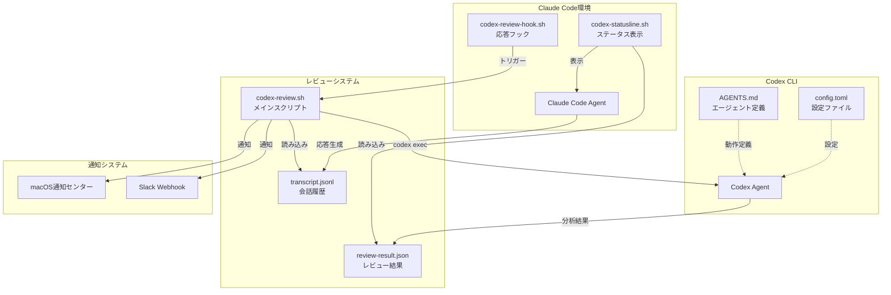

### データフロー

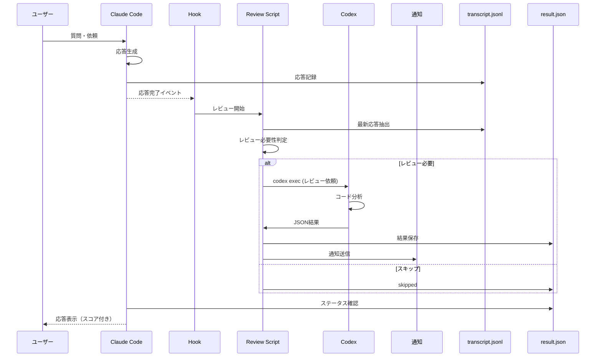

---

## 役割分担

### Codexがやること（調査・分析）

| カテゴリ | タスク例 |
|---------|---------|
| **🔍 調査** | コードベース分析、依存関係調査、アーキテクチャ理解 |
| **📚 ベストプラクティス** | セキュリティガイドライン、推奨手法の確認 |
| **🧪 技術検証** | ツール・ライブラリ評価、実装方法の比較 |
| **🐛 デバッグ** | エラー原因の深掘り、ログ解析 |
| **🏗️ 設計レビュー** | アーキテクチャ妥当性確認、代替案の検討 |
| **✅ コードレビュー** | PR差分レビュー、品質評価、問題指摘 |

### Claude Codeがやること（実装・修正）

| カテゴリ | タスク例 |
|---------|---------|
| **💻 実装** | 新機能の実装、バグ修正 |
| **✏️ コード修正** | レビュー指摘への対応、リファクタリング |
| **🧪 テスト実行** | ユニットテスト、統合テスト |
| **📦 デプロイ** | ビルド、デプロイ、CI/CD実行 |
| **📝 ドキュメント** | README更新、コメント追加 |
| **🔧 設定変更** | 設定ファイル編集、環境構築 |

### 協業の原則

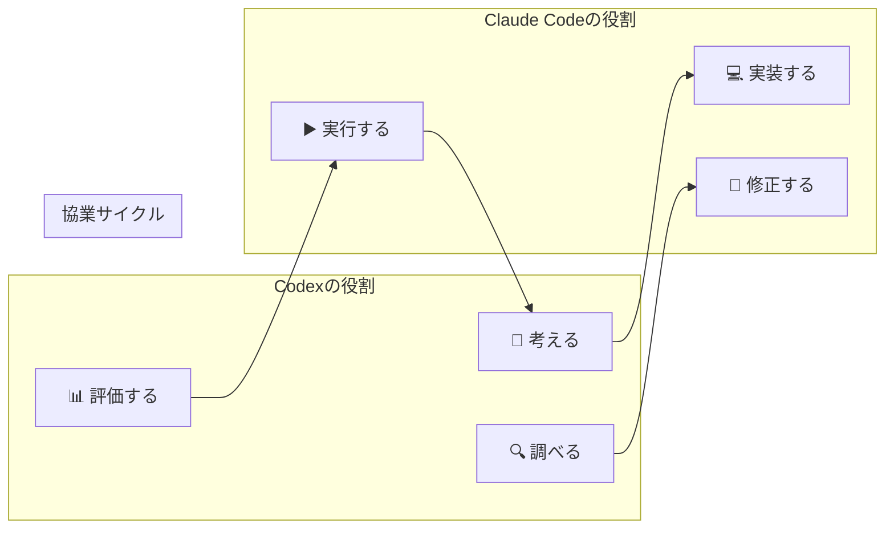

---

## 3つのレビューフェーズ

### フェーズ概要

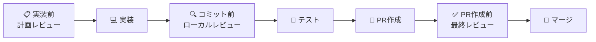

### フェーズ1: 実装前レビュー（計画・TODO）

**目的**: 設計の妥当性確認、潜在的な問題の早期発見

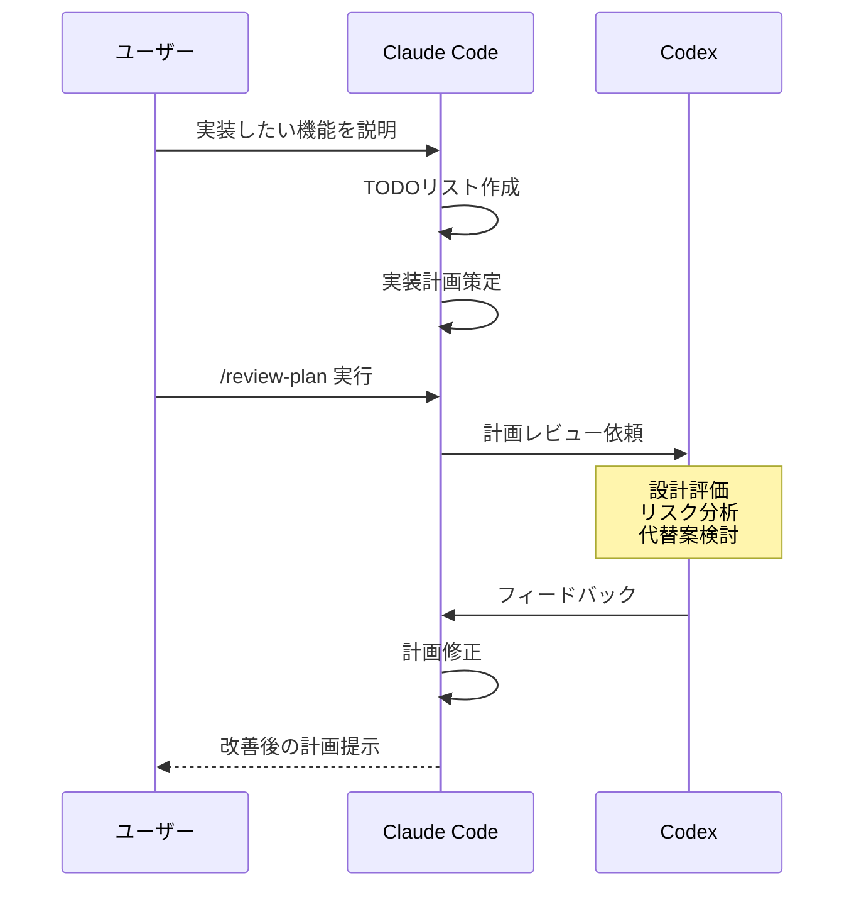

**テンプレート例**:

```bash
cat > /tmp/plan_review.txt <<'EOF'
# 依頼の目的
以下の実装計画をレビュー。

## 背景・目的
ユーザー認証にJWT方式を導入し、セッション管理を改善する。

## 実装計画・TODO
- [ ] JWT生成・検証ライブラリの導入（PyJWT）
- [ ] 認証ミドルウェアの実装
- [ ] トークンリフレッシュ機能の実装
- [ ] 既存セッション方式からの移行

## 技術スタック
- Python 3.11
- FastAPI
- PyJWT
- Redis（トークン管理）

## 懸念点
- トークンの安全な保存方法
- リプレイ攻撃への対策
- 既存ユーザーへの影響

## レビュー観点
1. 🚨 セキュリティ: JWT実装のベストプラクティス
2. ⚠️ パフォーマンス: トークン検証の効率性
3. 💡 保守性: 移行戦略の妥当性
4. 📝 実装漏れ: エッジケースの考慮

## 期待する出力
- 計画の妥当性評価
- セキュリティリスクの指摘
- 推奨する改善案
EOF

codex exec "$(cat /tmp/plan_review.txt)"
```

**実施タイミング**:
- ✅ セキュリティ・インフラに影響する変更
- ✅ アーキテクチャ変更
- ✅ 初めて扱う技術スタック
- △ 複雑な実装（3時間以上）

---

### フェーズ2: コミット前レビュー（git diff）

**目的**: ローカル変更の品質確認、コミット前の最終チェック

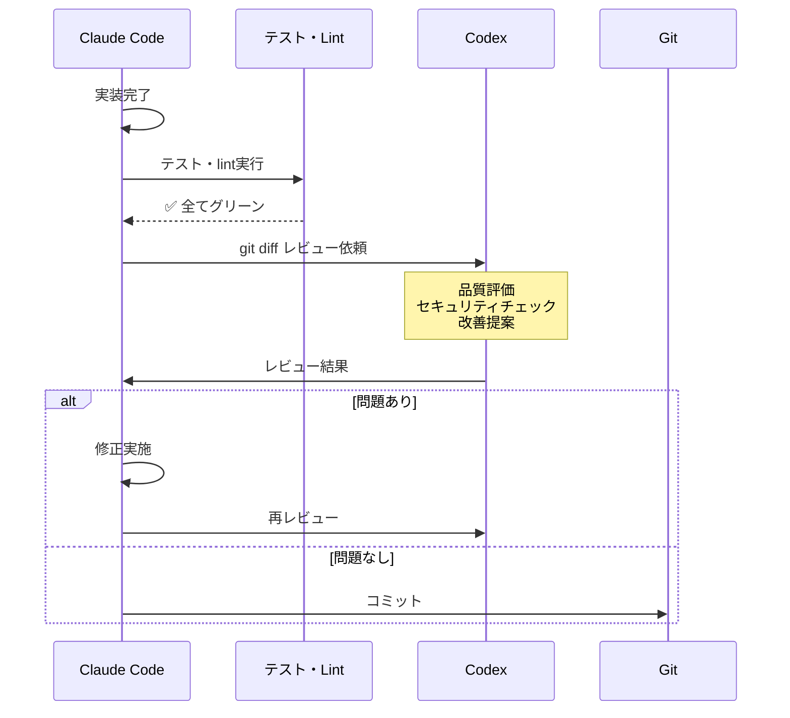

**テンプレート例**:

```bash
cat > /tmp/commit_review.txt <<'EOF'
# 依頼の目的
コミット前の変更をレビュー。

## 背景・目的
JWT認証ミドルウェアを実装。

## 実施済みの確認
- [x] pytest通過（100% coverage）
- [x] ruff check通過
- [x] 動作確認完了（ローカル環境）

## レビュー観点
1. 🚨 セキュリティ: トークン検証ロジック
2. ⚠️ パフォーマンス: 検証処理のボトルネック
3. 💡 保守性: コード品質、可読性
4. 📝 ドキュメント: docstringの妥当性

## 期待する出力
- 見落としている問題
- 改善できる点
- コミット前に対応すべき事項

**git statusとgit diffで変更内容を確認してレビュー。**
EOF

codex exec "$(cat /tmp/commit_review.txt)"
```

**実施タイミング**:
- ◎ セキュリティ関連変更（必須）
- ◎ Terraform変更（必須）
- ✅ 複雑な変更・大規模リファクタリング
- △ 通常の機能追加

---

### フェーズ3: PR作成前レビュー（gh pr diff）

**目的**: マージ前の最終確認、チームレビューの補完

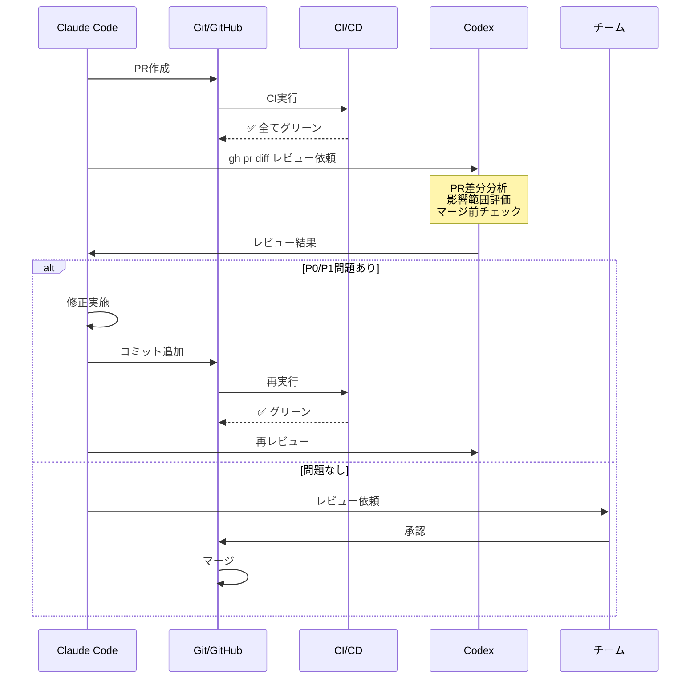

**テンプレート例**:

```bash
cat > /tmp/pr_review.txt <<'EOF'
# 依頼の目的
PR #123の最終レビュー。

## 背景・目的
JWT認証の導入により、セッション管理を改善し、スケーラビリティを向上する。

## PR情報
- 変更行数: 約500行
- 主要ファイル: auth/jwt.py, middleware/auth.py, tests/test_auth.py
- CI/CD: ✅ 全てグリーン

## レビュー観点
1. 🚨 セキュリティ: トークン漏洩、タイミング攻撃
2. ⚠️ パフォーマンス: 認証処理のボトルネック
3. 💡 保守性: エラーハンドリング、テストカバレッジ
4. 📝 ドキュメント: README、API仕様の更新

## 期待する出力
- マージ前に対応すべき問題（P0/P1）
- 改善提案（P2/P3）
- 次のPRで対応すべき技術的負債

**gh pr viewとgh pr diffで差分を確認してレビュー。**
EOF

codex exec "$(cat /tmp/pr_review.txt)"
```

**実施タイミング**:
- ◎ 全てのPR（推奨）
- ◎ CI/CDがグリーンになった後（必須）

---

### フェーズ比較表

| フェーズ | タイミング | 必須度 | 対象 | スキップ可能なケース |
|---------|-----------|--------|------|---------------------|
| **実装前** | 実装開始前 | △ | 計画・TODO・設計 | ドキュメント更新、タイポ修正 |
| **コミット前** | テスト通過後 | △ | git diff（ローカル変更） | 設定値のみの変更 |
| **PR作成前** | PR作成後 | ◎ | gh pr diff（PR差分） | - |

**必須とするケース**:
- セキュリティ関連（認証、IAM、暗号化）
- インフラ変更（Terraform、DBスキーマ）
- 本番影響が大きい変更

---

## 実装詳細

### 1. Codex実行の基本

```bash
# 短い依頼（200文字未満）
codex exec "このリポジトリのテスト戦略を分析"

# 長い依頼（ファイルに書き出し）
cat > /tmp/codex_request.txt <<'EOF'
# 依頼の目的
PR #123をレビュー。

## 手順
1. gh pr view --comments でPRの背景確認
2. gh pr diff で差分確認
3. セキュリティ・品質の観点でレビュー

## 期待する出力
- 優先度別の問題リスト（P0-P3）
- 具体的な改善案
EOF

codex exec "$(cat /tmp/codex_request.txt)"
```

### 2. 自動レビューシステム

#### codex-review.sh の仕組み

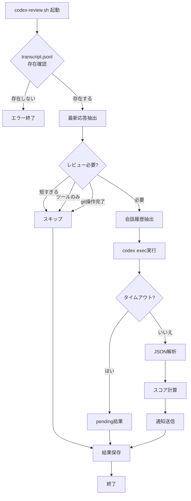

#### 環境変数による設定

```bash
# ~/.env.local に追加
export CODEX_REVIEW_TIMEOUT=10           # タイムアウト（秒）
export CODEX_REVIEW_VERBOSE=true         # 詳細ログ
export CODEX_REVIEW_NOTIFY=true          # 通知有効化
export CODEX_REVIEW_SLACK_WEBHOOK="https://hooks.slack.com/..."  # Slack通知
```

### 3. カスタムスラッシュコマンド

#### /review-pr の仕組み

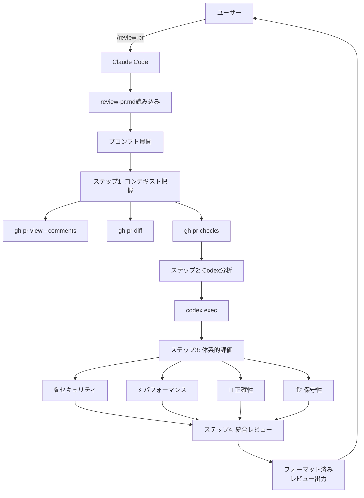

#### カスタムコマンドの作成

```bash
# プロジェクト固有のコマンド
# .claude/commands/deploy.md → /project:deploy

# ユーザー固有のコマンド（全プロジェクトで利用）
# config/claude/commands/review.md → /user:review
# dotfilesでシンボリックリンク管理
```

---

## 使い方ガイド

### シナリオ1: 新機能の実装

```bash
# 1. 実装前レビュー（計画）
cat > /tmp/plan.txt <<'EOF'
# 依頼の目的
以下の実装計画をレビュー。

## 背景・目的
[機能の説明]

## 実装計画・TODO
- [ ] タスク1
- [ ] タスク2

## レビュー観点
1. 🚨 セキュリティ: [懸念点]
2. ⚠️ パフォーマンス: [チェック項目]
3. 💡 保守性: [設計の妥当性]
EOF
codex exec "$(cat /tmp/plan.txt)"

# 2. 実装
# Claude Codeで実装

# 3. コミット前レビュー
cat > /tmp/commit.txt <<'EOF'
# 依頼の目的
コミット前の変更をレビュー。

## 実施済み
- [x] テスト通過
- [x] lint通過

**git statusとgit diffで変更内容を確認してレビュー。**
EOF
codex exec "$(cat /tmp/commit.txt)"

# 4. コミット
git add .
git commit -m "feat: 新機能実装"

# 5. PR作成
git push origin feature-branch
gh pr create --title "新機能実装" --body "..."

# 6. PR作成前レビュー
/review-pr  # カスタムコマンド
```

### シナリオ2: バグ修正

```bash
# 1. 原因調査（Codex活用）
codex exec "以下のエラーログを分析し、原因を特定:
[エラーログ]"

# 2. 修正実装（Claude Code）
# Claude Codeで修正

# 3. コミット前レビュー
cat > /tmp/bugfix_review.txt <<'EOF'
# 依頼の目的
バグ修正のレビュー。

## 背景
[バグの説明]

## 修正内容
[修正の概要]

**git diffで変更を確認。**
EOF
codex exec "$(cat /tmp/bugfix_review.txt)"

# 4. PR作成 + レビュー
gh pr create --title "fix: バグ修正" --body "..."
/review-pr
```

### シナリオ3: Terraform変更

```bash
# 1. 実装前レビュー（必須）
cat > /tmp/tf_plan.txt <<'EOF'
# 依頼の目的
Terraform変更計画をレビュー。

## 背景・目的
[変更理由]

## 変更内容
- IAMポリシー追加
- S3バケット設定変更

## レビュー観点
1. 🚨 セキュリティ: 過度な権限付与、公開設定
2. ⚠️ コスト: ストレージクラス、ライフサイクル
3. 💡 保守性: 命名規則、変数化
EOF
codex exec "$(cat /tmp/tf_plan.txt)"

# 2. 実装
# Claude Codeで実装

# 3. コミット前レビュー（必須）
cat > /tmp/tf_commit.txt <<'EOF'
# 依頼の目的
Terraform変更のコミット前レビュー。

**git diffで変更を確認し、セキュリティとベストプラクティスを重点的にチェック。**
EOF
codex exec "$(cat /tmp/tf_commit.txt)"

# 4. PR作成 + レビュー
gh pr create --title "terraform: IAM・S3設定追加" --body "..."
/review-pr

# 5. terraform plan確認（CI/CD）
gh pr checks --watch
```

---

## ベストプラクティス

### 1. タイムアウト設定の使い分け

| PR規模 | 行数 | タイムアウト | 実行方法 |
|--------|------|-------------|---------|
| 小規模 | ~300行 | 2分（デフォルト） | `codex exec "..."` |
| 中規模 | 300~1000行 | 5分 | `CODEX_REVIEW_TIMEOUT=300 codex exec "..."` |
| 大規模 | 1000~2000行 | 10分 | `CODEX_REVIEW_TIMEOUT=600 codex exec "..."` |
| 超大規模 | 2000行以上 | 10分 + 重点指示 | 重点ファイルを明示 |

**Claude CodeでBashツールを使う場合**:

```bash
# 大規模PRレビュー（タイムアウト10分）
codex exec "..." --timeout 600
```

### 2. Reasoning Level（推論レベル）の使い分け

| Reasoning Level | 応答速度 | 分析の深さ | 適用ケース |
|----------------|---------|-----------|-----------|
| `low` | ⚡ 高速 | 簡易 | 簡単な調査、クイックレビュー、構文チェック |
| `medium`（デフォルト） | 🔄 中速 | 標準 | 通常のPRレビュー、バグ調査 |
| `high` | 🐢 低速 | 詳細 | セキュリティ監査、アーキテクチャ評価、大規模リファクタリング |

**使用例**:

```bash
# 高速レスポンス（簡易レビュー）
codex exec --reasoning low "このPRの構文エラーをチェック"

# 標準レビュー（デフォルト）
codex exec "PR #123をレビュー"

# 詳細分析（セキュリティ重視）
codex exec --reasoning high "このセキュリティ変更を詳細にレビュー"
```

**選び方の目安**:
- **`low`**: 数十秒〜1分で結果が欲しい、シンプルな確認作業
- **`medium`**: 1-3分で標準的なレビュー
- **`high`**: 3-5分かけて徹底的に分析したい

### 3. レビュー依頼の構造（推奨）

```markdown
# 依頼の目的
[何をレビューしてほしいか - 1文]

## 背景・目的
[なぜこの変更が必要か - 2-3文]

## レビュー観点（優先度付き）
1. 🚨 セキュリティ: [具体的な懸念点]
2. ⚠️ パフォーマンス: [チェックしてほしい点]
3. 💡 保守性: [評価してほしい設計]
4. 📝 ドキュメント: [確認してほしい更新]

## 期待する出力
- 優先度別の問題リスト（P0-P3）
- 各問題に対する具体的な改善案
- 次のアクションアイテム

**gh pr diffで差分を確認してレビュー。**
```

### 4. False Positiveへの対処

Codexの指摘を鵜呑みにせず、Claude Codeが検証：

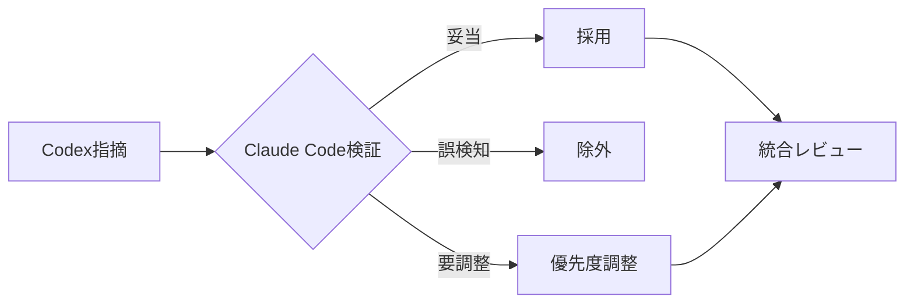

**検証観点**:
- プロジェクト固有の文脈・制約
- チームの合意事項
- 既存の設計パターン
- 技術的負債の受容範囲

### 5. 通知設定の最適化

```bash
# ~/.env.local

# 開発中: 詳細ログ + macOS通知のみ
export CODEX_REVIEW_VERBOSE=true
export CODEX_REVIEW_NOTIFY=true
# CODEX_REVIEW_SLACK_WEBHOOK は設定しない

# チーム開発: Slack通知追加
export CODEX_REVIEW_VERBOSE=false
export CODEX_REVIEW_NOTIFY=true
export CODEX_REVIEW_SLACK_WEBHOOK="https://hooks.slack.com/..."
```

### 6. 大規模PRの扱い

```bash
# 実装概要と重点ファイルを明示
cat > /tmp/large_pr.txt <<'EOF'
# 依頼の目的
PR #789の大規模変更（2000行以上）をレビュー。

## 実装概要
認証システムのリファクタリングとセキュリティ強化

## 重点レビュー対象ファイル
1. auth/jwt.py - JWT生成・検証ロジック（最重要）
2. auth/password.py - パスワードハッシュ化
3. middleware/auth.py - 認証ミドルウェア

## レビュー観点
1. 🚨 セキュリティ: トークン漏洩、タイミング攻撃
2. ⚠️ パフォーマンス: 認証処理のボトルネック
3. 💡 保守性: エラーハンドリング、テストカバレッジ

**gh pr diffで差分を確認し、上記ファイルを重点的にレビュー。**
**関連する既存ファイルも必要に応じて読んで、整合性を確認。**
EOF

codex exec "$(cat /tmp/large_pr.txt)"
```

---

## トラブルシューティング

### 1. Codexがタイムアウトする

**症状**: `Review timeout (>10s)` エラー

**原因**:
- PR規模が大きすぎる（2000行以上）
- ネットワーク遅延
- Codex APIの負荷

**対処法**:

```bash
# タイムアウトを延長（環境変数）
export CODEX_REVIEW_TIMEOUT=300  # 5分

# または一時的に設定
CODEX_REVIEW_TIMEOUT=600 codex exec "..."

# 大規模PRは重点ファイルを指定
```

### 2. レビュー結果が表示されない

**症状**: ステータスラインにスコアが表示されない

**原因**:
- review-result.json の破損
- jq コマンドの不在
- ファイルパーミッションエラー

**対処法**:

```bash
# レビュー結果ファイルの確認
cat /tmp/claude-codex-review-$(echo -n "$PWD" | md5 | cut -c1-8).json

# ログの確認
tail -f /tmp/claude-codex-review-$(echo -n "$PWD" | md5 | cut -c1-8).log

# jqのインストール確認
which jq || brew install jq

# ファイルパーミッションの修正
chmod 600 /tmp/claude-codex-review-*.json
```

### 3. Slack通知が送信されない

**症状**: macOS通知は届くが、Slackに通知されない

**原因**:
- Webhook URLの設定ミス
- JSONペイロードの破損
- ネットワークエラー

**対処法**:

```bash
# Webhook URLの確認
echo $CODEX_REVIEW_SLACK_WEBHOOK

# 詳細ログで送信内容を確認
export CODEX_REVIEW_VERBOSE=true

# 手動テスト
curl -X POST -H 'Content-type: application/json' \
    --data '{"text":"Test notification"}' \
    "$CODEX_REVIEW_SLACK_WEBHOOK"
```

### 4. False Positiveが多い

**症状**: Codexが不適切な指摘をする

**原因**:
- プロジェクト固有の文脈を理解していない
- チーム規約の考慮不足

**対処法**:

```bash
# より詳細な文脈を提供
cat > /tmp/context_review.txt <<'EOF'
# 依頼の目的
PR #123をレビュー。

## プロジェクト固有の制約
- このプロジェクトでは、パフォーマンスよりも可読性を優先する
- エラーハンドリングは既存パターン（custom_exception.py）に従う
- テストは pytest + pytest-cov を使用し、カバレッジ80%以上が必須

## チーム規約
- 関数名はスネークケース
- docstringはGoogle形式
- 型ヒントは必須（Python 3.11+）

**上記の制約とチーム規約を考慮してレビュー。**
EOF

codex exec "$(cat /tmp/context_review.txt)"
```

### 5. 複数プロジェクトで結果が混在する

**症状**: 異なるプロジェクトのレビュー結果が表示される

**原因**: ワーキングディレクトリのハッシュ衝突（稀）

**対処法**:

```bash
# プロジェクトごとに結果ファイルを確認
WORKDIR_HASH=$(echo -n "$PWD" | md5 | cut -c1-8)
echo "Current hash: $WORKDIR_HASH"
ls -la /tmp/claude-codex-review-${WORKDIR_HASH}*

# 古い結果ファイルを削除
rm /tmp/claude-codex-review-${WORKDIR_HASH}*
```

---

## 参考資料

### 関連ファイル

| ファイル | 説明 |
|---------|------|
| `config/claude/codex-templates.md` | Codex依頼テンプレート集 |
| `config/claude/commands/review-pr.md` | PRレビュー用カスタムコマンド |
| `config/claude/codex-review.sh` | 自動レビュースクリプト |
| `config/claude/codex-statusline.sh` | ステータス表示スクリプト |
| `config/codex/config.toml` | Codex CLI設定 |
| `config/codex/AGENTS.md` | Codexエージェント定義 |

### 外部リンク

- [Claude Code ドキュメント](https://docs.claude.com/en/docs/claude-code)
- [Codex CLI GitHub](https://github.com/anthropics/codex-cli)
- [Mermaid ドキュメント](https://mermaid.js.org/)

---

## まとめ

Claude CodeとCodexの協業で実現できること：

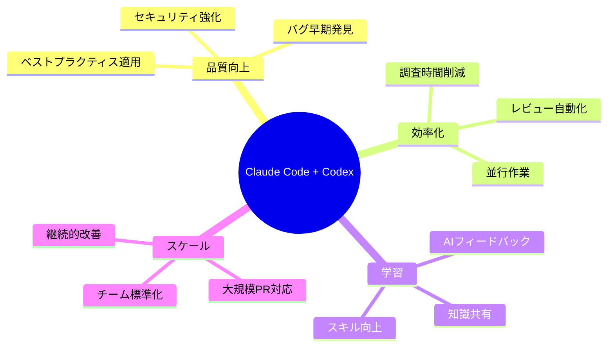
