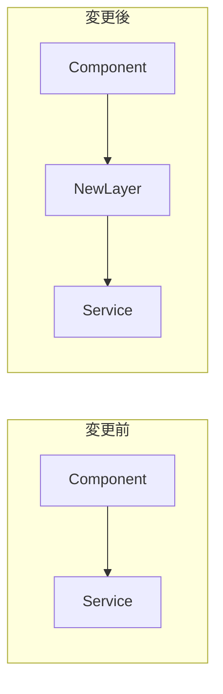
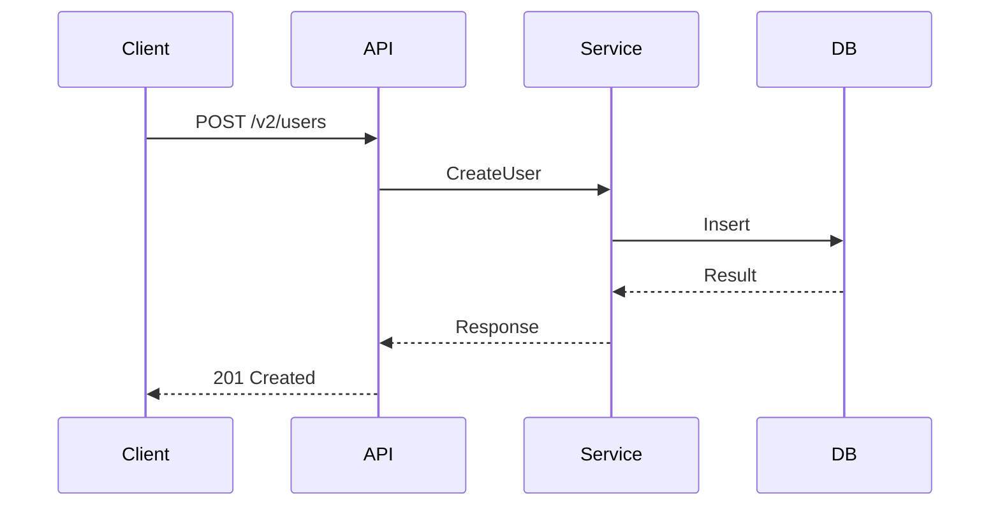
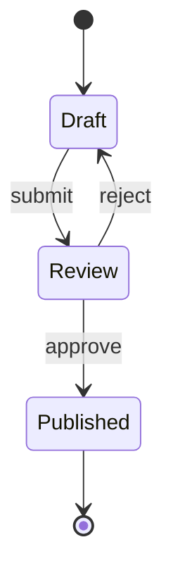

# スマートPR作成コマンド

git diffを分析して、Mermaid図やテスト結果を含む包括的なPull Requestを自動作成します。

## 実行手順

### 1. 変更内容の分析

まず現在の変更を分析：
```bash
# 変更状態を確認
git status

# 変更内容を詳細に確認
git diff --cached
git diff

# コミット履歴を確認
git log --oneline -10

# ブランチ情報を確認
git branch --show-current
git rev-parse --abbrev-ref @{u} 2>/dev/null || echo "No upstream branch"
```

### 2. 変更タイプの自動判定

変更内容から以下を分析：
- **変更規模**: 追加/削除行数、ファイル数
- **変更タイプ**: feat/fix/refactor/docs/test/chore
- **影響範囲**: 変更ファイルの依存関係
- **Breaking Change**: API変更、設定変更、削除されたメソッド

### 3. Mermaid図の生成（必要に応じて）

以下の条件で自動的に図を生成：

#### アーキテクチャ変更が検出された場合


#### APIエンドポイント変更の場合


#### 状態管理変更の場合


### 4. テストとチェックの実行

```bash
# プロジェクトのテストコマンドを検出して実行
if [ -f "package.json" ]; then
    # Node.jsプロジェクト
    npm test 2>&1 || yarn test 2>&1 || pnpm test 2>&1
elif [ -f "Cargo.toml" ]; then
    # Rustプロジェクト
    cargo test
elif [ -f "go.mod" ]; then
    # Goプロジェクト
    go test ./...
elif [ -f "requirements.txt" ] || [ -f "pyproject.toml" ]; then
    # Pythonプロジェクト
    pytest || python -m pytest
fi

# Lintチェック
if [ -f "package.json" ]; then
    npm run lint 2>&1 || yarn lint 2>&1 || true
fi

# 型チェック
if [ -f "tsconfig.json" ]; then
    npm run typecheck 2>&1 || npx tsc --noEmit || true
fi
```

### 5. PR本文の生成

以下のテンプレートで自動生成：

```markdown
## 🎯 概要
[1-2行で変更の目的を説明]

## 📝 変更内容
- [主要な変更点を箇条書き]
- [技術的な詳細]
- [追加/削除された機能]

## 📊 変更の可視化
[必要に応じてMermaid図を挿入]

## ✅ チェックリスト
- [ ] テストが全て通過
- [ ] Lintエラーなし
- [ ] 型チェック通過
- [ ] ドキュメント更新
- [ ] Breaking Changeの記載（該当する場合）

## 🧪 テスト結果
```
[テスト実行結果を挿入]
```

## 📈 影響範囲
- **影響を受けるファイル**: X files
- **追加行数**: +XXX
- **削除行数**: -XXX
- **影響を受ける機能**: [機能リスト]

## ⚠️ Breaking Changes
[該当する場合のみ]
- [破壊的変更の詳細]
- [移行方法]

## 🔄 ロールバック手順
[必要に応じて記載]

## 📚 関連情報
- Issue: #XXX
- 関連PR: #XXX
- ドキュメント: [リンク]

---
🤖 Generated with [Claude Code](https://claude.ai/code)
```

### 6. PRの作成

```bash
# コマンド引数を解析
DRAFT_FLAG=""
REMAINING_ARGS=()
for arg in "$@"; do
    if [ "$arg" = "--draft" ]; then
        DRAFT_FLAG="--draft"
    else
        REMAINING_ARGS+=("$arg")
    fi
done
```

```bash
# Terraformリポジトリの場合はフォーマット実行
if [ -f "terraform.tf" ] || [ -f "main.tf" ] || [ -f "provider.tf" ] || [ -d ".terraform" ]; then
    echo "Terraformリポジトリを検出しました。"
    echo "Terraformファイルをフォーマットします..."
    terraform fmt -recursive || {
        echo "警告: terraform fmtが失敗しました。Terraformがインストールされていない可能性があります。"
    }
fi

# 変更をコミット（まだの場合）
git add -A
git commit -m "feat: [簡潔な説明]

[詳細な説明]

🤖 Generated with [Claude Code](https://claude.ai/code)"

# ブランチをプッシュ
git push -u origin HEAD

# GitHub CLIでPR作成
PR_URL=$(gh pr create \
    --title "[Type]: 簡潔なタイトル" \
    --body "[生成されたPR本文]" \
    --assignee @me \
    $DRAFT_FLAG)

# PR作成成功時にthコマンドで作業報告
if [ -n "$PR_URL" ]; then
    PR_NUMBER=$(echo "$PR_URL" | grep -oE '[0-9]+$')
    th "✅ PR #${PR_NUMBER} 作成完了: ${PR_URL}"
    echo "✅ PR作成が完了し、Obsidianに記録しました: $PR_URL"
fi
```

## オプション

### 最小限モード
シンプルなPRを作成したい場合：
- Mermaid図なし
- 基本的なテスト結果のみ
- 簡潔な説明

### 詳細モード（デフォルト）
包括的な情報を含むPR：
- 変更内容に応じたMermaid図
- 完全なテスト結果
- 影響範囲分析
- セキュリティチェック

## 使用例

```bash
# 基本的な使用
/create-pr

# 特定のタイトルでPR作成
/create-pr "feat: ユーザー認証機能の追加"

# ドラフトPRとして作成
/create-pr --draft
```

## 注意事項

1. **コミット前の確認**: 機密情報が含まれていないか確認
2. **テスト実行**: PR作成前に必ずテストを実行
3. **ブランチ名**: 意味のある名前を使用（例: feature/user-auth）
4. **PR説明**: レビュアーが理解しやすいよう詳細に記載

## トラブルシューティング

- **テストが失敗する場合**: エラーを修正してから再実行
- **図が生成されない場合**: 変更が小規模な場合は図は生成されません
- **PR作成に失敗する場合**: GitHub CLIの認証を確認（`gh auth status`）