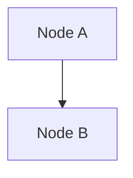

# ObsidianでMermaidを書くときのルール

## `graph TD`を使う

ObsidianのMermaidレンダラーは`flowchart TD`を完全にサポートしていない。`graph TD`を使う。



## ノードテキストに番号付きリストを書かない

`1. ` `2. ` のように数字+ドット+スペースで始まるテキストは、Markdownの順序付きリストとして解釈されて`Unsupported markdown: list`になる。

```
%% NG
A["1. Pub/Sub subscribe"]

%% OK
A[Pub/Sub subscribe]
```

## subgraphにはIDを付ける

```
%% NG
subgraph 計測対象

%% OK
subgraph SG[計測対象]
```
