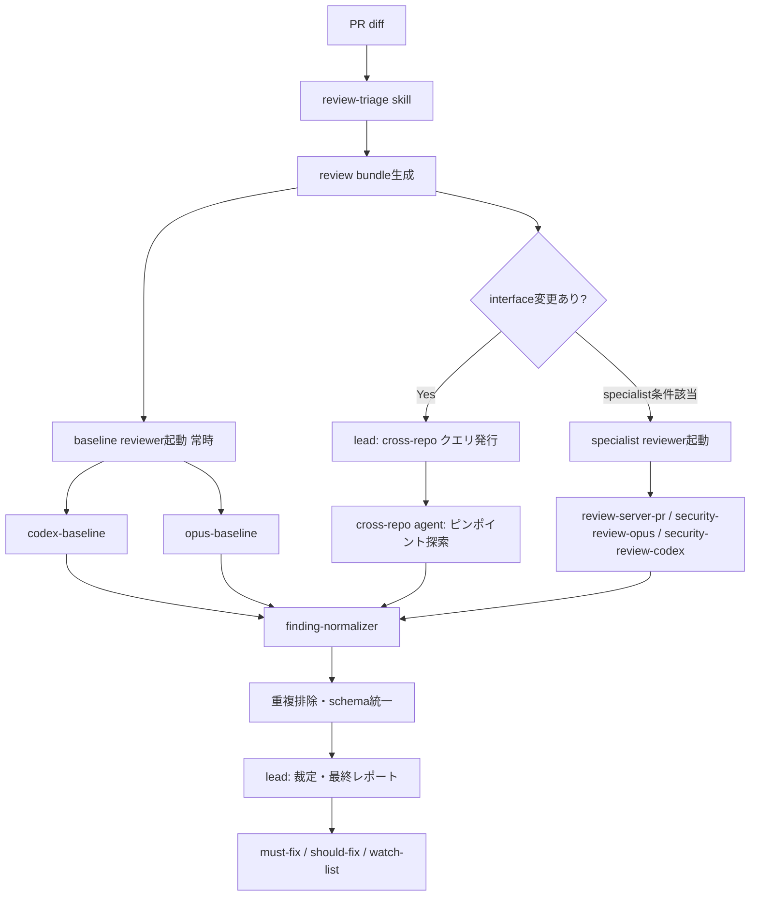

## 背景

既存のコードレビュー運用を、Opus（Claude Code）＋Codex のマルチエージェント構成に進化させる。参考: https://wasabeef.jp/blog/claude-code-agent-teams

### 課題

- 単一エージェントだと観点の偏りが出る（設計と実装の両面を同時に深く見るのが苦手）
- server / server-config / ops の複数リポにまたがる変更で、クロスリポの影響範囲を見落とす
- セキュリティレビューでLLM単体だと false positive が増える
- 既存skill（review-pr, review-server-pr, codex-review, cross-repo, security-review）が個別に存在し、統合運用できていない

### ゴール

- Opus と Codex の二系統レビューで観点の網羅性を上げる
- クロスリポ影響を低コストかつ漏れなく検出する
- 既存skillを活かす形で段階的に移行する
- lead（Opus）は router + judge に徹する。自分でレビューしない

## 全体アーキテクチャ



## フェーズ別実装計画

### Phase 1: review-triage skill

PR diff から以下を判定する薄いskill。LLMに丸投げしない。機械判定優先、境界ケースのみLLM。

#### 入力

入力モードは2種類。モード別に必須項目が異なる。

| 項目 | `pr` モード | `local-diff` モード |
|------|-------------|---------------------|
| `pr_ref` | required | null（nullable） |
| PR metadata（タイトル、ラベル、作成者） | required | optional |
| `base_sha` / `head_sha` | required | required |
| `repo_roots` | required | required |
| changed file list + diffstat | required | required |
| diff（各 changed file の hunk header + 先頭/末尾抜粋） | required | required |

full diff は読まない（コスト対策）。各 changed file の hunk header + 先頭/末尾抜粋で critical path を拾う。

#### 判定軸

- 粒度: 行数 / ファイル数 / クリティカルパス該当 で `quick / standard / deep` を決定
  - クリティカルパス: migration, auth, 決済, IAM, proto, schema
- 対象リポ: パスパターン + import/RPC参照から推定
  - `proto/`, `api/`, `schema/` → server-config/ops に波及
  - `terraform/`, manifest → ops 確定
  - secret / env var 追加 → server-config 確定
- リスクタグ: `breaking-change`, `security-sensitive`, `data-migration`, `cross-repo` 等

#### 出力schema（JSON固定）

```json
{
  "pr_ref": "github.com/org/server#1234",
  "base_sha": "abc1234",
  "head_sha": "def5678",
  "repo_roots": {
    "server": "/path/to/server",
    "server-config": "/path/to/server-config"
  },
  "size": "quick|standard|deep",
  "risk_tags": ["breaking-change", "security-sensitive"],
  "changed_files": [
    {"repo": "server", "path": "api/payment/v1/payment.proto", "status": "modified"},
    {"repo": "server-config", "path": "config/payment.yaml", "status": "added"}
  ],
  "changed_symbols": [
    {"repo": "server", "path": "api/payment/v1/payment.proto", "kind": "rpc", "name": "GetPayment"}
  ],
  "changed_env_vars": [
    {"repo": "server-config", "path": "config/payment.yaml", "name": "PAYMENT_API_URL"}
  ],
  "changed_protos": [{"repo": "server", "path": "api/payment/v1"}],
  "changed_schemas": [],
  "selected_reviewers": [
    "codex-baseline",
    "opus-baseline",
    "security-review-opus",
    "security-review-codex",
    "cross-repo"
  ],
  "why_selected": {
    "cross-repo": "proto変更あり、server-config側の consumer 要確認"
  },
  "global_token_budget": 200000,
  "per_reviewer_budget": 50000,
  "must_check_interfaces": [
    {
      "type": "rpc",
      "name": "GetPayment",
      "source_repo": "server",
      "source_path": "api/payment/v1/payment.proto",
      "source_symbol": "GetPayment",
      "candidate_repos": ["server-config", "ops"]
    }
  ]
}
```

型の補足:

- `changed_files[].status`: `added | modified | deleted | renamed` の enum
- `changed_repos` は冗長なので廃止。`changed_files[].repo` を唯一の真実とする（派生が必要なら実装で算出）
- 各インターフェース配列は型を分離:
  - `changed_symbols[]`: `{repo, path, kind, name}`（kind: `rpc | function | method | type | const`）
  - `changed_protos[]`: `{repo, path}`（パッケージ単位）
  - `changed_env_vars[]`: `{repo, path, name}`
  - `changed_schemas[]`: `{repo, path, name?}`（DB schema / migration）
- `must_check_interfaces[].candidate_repos`: 確認候補のconsumer側リポ（方向: source→candidate）
- `global_token_budget` / `per_reviewer_budget` の単位は tokens
- size判定しきい値（`quick`: <50行、`standard`: <300行 等）は本文ではなく外部設定ファイルで管理

reviewer_id は以下を固定値とする（ブレ防止）:

| reviewer_id | 種別 | 実体 |
|-------------|------|------|
| `codex-baseline` | baseline | Codex + codex-review skill |
| `opus-baseline` | baseline | Opus subagent |
| `review-server-pr` | specialist | 既存skill |
| `security-review-opus` | specialist | Opus + security-review skill |
| `security-review-codex` | specialist | Codex + security-review観点 |
| `cross-repo` | specialist | cross-repo agent |

### Phase 2: review bundle 生成

triage結果を元に、全reviewerが共有する静的コンテキストを1回だけ作る。これが最大のコスト削減ポイント。

#### bundle 内容

必須:

- `changed_file_manifest`: 変更ファイル一覧 + 変更行数
- `repo_summary`: 各リポジトリの役割・主要ディレクトリのマップ（別キャッシュジョブで更新、PR実行時は生成しない）
- `interface_changes`: triageの `changed_symbols / changed_protos / changed_env_vars` を整形
- `risk_tags`: 継承
- `relevant_snippets`: 変更周辺の±30行コード
- `review_slices`: `reviewer_id → [{repo, path, hunk_ranges?: [{start, end}], reason}]` のマップ（誰が何を見るかを bundle 側で固定）
- `path_reason_map`: ファイルパス → なぜそのファイルが関心対象かの理由

拡張（PoC後に検討）:

- `symbol_index`: 変更シンボルの定義・参照箇所インデックス
- `ownership_hint`: CODEOWNERS や git log からの owner 推定
- `generated_or_vendor_flag`: 生成物・vendor ディレクトリ判定
- `test_delta`: 変更に対応するテストファイルの差分
- `static_analysis_summary`: Semgrep/gosec等の事前実行結果
- `open_questions`: triageで判定に迷った箇所のメモ

#### 配布方針

- reviewerには full PR ではなく `bundle + review_slices[reviewer_id] の diff slice` だけ渡す
- bundleはファイルとして出力し、agentプロンプトにパス参照で渡す（トークン節約）

### Phase 3: reviewer 起動

2層構成: baseline reviewer は常時、specialist reviewer は triage 条件付き。

#### baseline reviewer（常時実行）

- `codex-baseline`: Codex経由（既存 codex-review skill 流用）
  - 観点: 実装詳細、エッジケース、境界値、同時実行、権限不足
- `opus-baseline`: Opus subagent
  - 観点: 設計意図、影響範囲、APIコントラクト整合性

Opus と Codex で観点を意図的にずらす。同じ観点で並列に走らせない。

#### specialist reviewer（条件付き起動）

triage出力の `selected_reviewers` を authoritative とする。後段はルール再評価せず、そのまま従う。条件表は triage 実装の判定ルール定義を兼ねる。

| reviewer_id | triage判定ルール |
|-------------|------------------|
| `review-server-pr` | critical path 命中（API/DB/auth/proto変更）かつ `server` を含む |
| `security-review-opus` | `risk_tags` に `security-sensitive` / auth / IAM |
| `security-review-codex` | 同上、二系統でcross-validation |
| `cross-repo` | `must_check_interfaces` が空でない |

#### cross-repo agent の呼び出し方（重要）

リポ全探索ではなく、lead が発行するピンポイントクエリに答える形にする。

クエリ粒度:

- `pinpoint`: ファイル・シンボル指定（例: `config/payment.yaml の timeout_ms`）→ Read一発
- `scoped`: ディレクトリ + パターン（例: `ops/terraform/ で iam_role.payment-*`）→ Grep + Read
- `survey`: 概念検索（コスト高、最後の手段）

クエリ構造:

```json
{
  "repo": "server-config",
  "query_type": "pinpoint|scoped|survey",
  "source": {
    "repo": "server",
    "file": "api/payment/v1/payment.proto",
    "lines": {"start": 10, "end": 25},
    "symbol": "GetPayment"
  },
  "target": "GetPayment RPCのconsumer",
  "search_pattern": "GetPayment|PaymentClient",
  "reason": "proto変更によりconsumer側のシリアライズ互換性を確認",
  "max_queries": 5,
  "stop_if_found": true,
  "allow_survey": false,
  "expected_output": "呼び出し箇所のfile:line + コンテキスト"
}
```

survey 昇格条件: pinpoint/scoped でヒットゼロ かつ `must_check_interfaces` が未解決 かつ `allow_survey: true` の場合のみ。いずれかを満たさないクエリは survey にフォールバックしない。

### Phase 4: finding-normalizer

reviewer の出力を共通 schema に正規化し、重複排除する。

#### 共通 finding schema（必須項目）

```json
{
  "finding_id": "codex-baseline-a3f2c1",
  "source_reviewer": "codex-baseline",
  "severity": "must-fix|should-fix|watch",
  "confidence": 0.85,
  "issue_type": "concurrency",
  "entity_key": "server:api/payment/service.go:GetPayment",
  "repo": "server",
  "file": "api/payment/service.go",
  "lines": {"start": 123, "end": 145},
  "related_locations": [
    {"repo": "server-config", "file": "config/payment.yaml", "lines": {"start": 10, "end": 15}}
  ],
  "claim": "トランザクション境界がcontext cancellationで不整合",
  "evidence": {
    "evidence_type": "diff|code|log",
    "excerpt": "ctx, cancel := context.WithCancel(...)\\ndefer cancel()",
    "location": {"repo": "server", "file": "api/payment/service.go", "lines": {"start": 125, "end": 128}}
  },
  "why_it_matters": "決済の部分コミットで金額不整合が発生しうる",
  "fix_hint": "defer で rollback を明示、または WithoutCancel でcontext分離"
}
```

型の補足:

- `finding_id`: `{source_reviewer}-{sha6(repo+file+lines+issue_type+entity_key)}` で決定論的に生成。reviewer ローカル連番は使わない（dedupeキーと同じ入力に揃える）
- `confidence`: `number`（0.0-1.0）、小数点以下2桁に丸める
- `entity_key`: 正規化規則 `{repo}:{path}:{symbol}`。symbol不明時は `{repo}:{path}`
- `lines`: `{start: int, end: int}` オブジェクト固定。文字列レンジは使わない
- `evidence`: 構造化必須。`evidence_type` なし or `excerpt` 空は品質フィルタで drop。PoCは単一 evidence、将来は複数根拠を `evidences[]` 配列化して拡張

`issue_type` は列挙値を固定する（dedupeキーとして使用）。初期列挙値:

- `concurrency` / `security` / `contract` / `perf` / `error-handling` / `naming` / `test-coverage` / `config` / `data-migration` / `iam` / `observability` / `other`

#### 品質フィルタ

- `evidence` が diff/コード断片に紐付かない指摘は落とす（`evidence_type` なし or `excerpt` 空）
- confidence 2段フィルタ:
  - low confidence + weak evidence → drop
  - low confidence + concrete evidence → watch-list
- reviewer毎の最大指摘数を設ける（high/mediumで各5件まで等）

#### dedupe ロジック

- キー: `repo + file + line-range + issue_type + entity_key`
- 類似line-range（±3行）＋ 同一 `issue_type` ＋ 同一 `entity_key` は同一指摘としてマージ
- `entity_key` が一致すれば caller/callee で別ファイルに現れる同一インターフェース不整合も統合
- conflicting findings（AさんがOK、BさんがNG）は `confidence × evidence具体性` で裁定

### Phase 5: lead 裁定・最終出力

lead（Opus）は以下のみ担当:

- reviewer 間で衝突した findings の裁定
- `must-fix / should-fix / watch-list` の3区分に振り分け
- サマリ生成（各区分で何件、主要論点は何か）

lead 自身は追加レビューしない。裁定と整形のみ。

## 運用設計

### コストゲート

全PRにフルチーム投入は重い。段階起動:

- 小さい変更（<50行、クリティカルパス外）: baseline reviewer のみ
- 標準変更（<300行）: baseline + 該当specialist
- 大規模・機微変更（>300行 or critical path）: フルチーム起動

triageで `size` を判定してこのゲートを制御。

### 並列 vs 直列

- triage → bundle: 直列（後段の前提）
- baseline + specialist reviewer: 並列
- cross-repo クエリ: 複数クエリは並列
- normalize → lead 裁定: 直列

### 静的解析との併用

security-review は Semgrep / gosec / tfsec の結果を事前コンテキストとして流し込む。LLM単体に探させない。

### false positive 対策サマリ

1. finding schema 強制（自由文禁止）
2. evidence 必須（紐付かない指摘は落とす）
3. reviewer毎の最大指摘数制限
4. dedupe は `repo + file + line-range + issue_type + entity_key` で判定（caller/calleeの同一不整合取りこぼし防止）
5. confidence の扱いは2段フィルタ:
   - low confidence + weak evidence → drop
   - low confidence + concrete evidence → watch-list

## 既存skillとの対応

| 既存skill | 新構成での役割 |
|-----------|---------------|
| review-pr | 廃止、または軽量モード用として残す |
| review-server-pr | specialist reviewer として残す |
| codex-review | baseline reviewer（codex-baseline）として流用 |
| cross-repo | cross-repo agent の基盤として拡張 |
| security-review | specialist reviewer（Opus + Codex二系統化） |

## 未決事項

### PoC前に必ず決める（schema/contract系）

| 項目 | 内容 |
|------|------|
| triage schema の JSON Schema 化 | `size` しきい値、`changed_files[].status` enum、全フィールドの型定義 |
| finding schema の JSON Schema 化 | `issue_type` 列挙値、`lines` オブジェクト形式、`evidence` 構造 |
| reviewer I/O contract | 入力（bundle + review_slice）と出力（finding配列）の仕様 |
| `selected_reviewers` の単一責任 | triage出力を authoritative とし、後段は再判定しない旨を明記済み |
| `finding_id` 生成規則 | `{source_reviewer}-{sha6(repo+file+lines+issue_type)}` で決定論的に |
| `entity_key` 正規化規則 | `{repo}:{path}:{symbol}` で固定、symbol不明時は `{repo}:{path}` |
| dedupe キーの正文 | `repo + file + line-range + issue_type + entity_key` で固定 |
| `must_check_interfaces[]` の向き | `source_repo/source_path/source_symbol` + `candidate_repos` |
| token_budget のスコープ | `global_token_budget` と `per_reviewer_budget` に分離 |
| survey 昇格条件 | pinpoint/scoped でヒットゼロ かつ `must_check_interfaces` 未解決 かつ `allow_survey: true` |

### PoC後に決める

- review-triage skill の実装言語（bash / Python / Node）
- bundle の保存先（`.claude/cache/` か 一時ディレクトリか）
- finding-normalizer の実装形式（skill化 or leadプロンプト内処理）
- reviewer毎の最大指摘数のデフォルト値（PoCで件数分布を見てから）
- `repo_summary` のキャッシュ戦略・更新ジョブ設計
- bundle 拡張項目（`symbol_index / ownership_hint / static_analysis_summary` 等）の導入順

## 次の一手

実装順は schema/contract 先行で手戻りを最小化する:

1. finding schema を JSON Schema で固定（`issue_type` 列挙値、`lines` オブジェクト形式含む）
2. reviewer I/O contract を固定（入力: bundle + review_slice / 出力: finding配列）
3. triage schema を JSON Schema で固定（`must_check_interfaces` の向き、`changed_files[].status` enum含む）
4. 最小 bundle 生成の実装（`changed_file_manifest + interface_changes + relevant_snippets + review_slices` のみ）
5. review-triage skill の実装（判定ルールは外部設定ファイル化）
6. 既存 codex-review skill を baseline reviewer 用にリファクタ
7. 最小構成（triage + codex-baseline + opus-baseline + normalizer）でPoC
8. cross-repo クエリの実装、normalizer高度化（dedupe, conflicting裁定）
9. specialist reviewer（security二系統、review-server-pr）追加

## 参考

- https://wasabeef.jp/blog/claude-code-agent-teams
- Codexとのセカンドオピニオン議論（2026-04-17セッション）

## Changelog

- 2026-04-17 初版作成
- 2026-04-17 Codexレビュー1回目反映（P0: アーキ図矛盾修正、changed_files を repo-qualified化、issue_type 必須化、reviewer_id 固定値テーブル追加）、次の一手を schema先行順に変更、dedupe条件とconfidenceフィルタを具体化
- 2026-04-17 Codexレビュー3回目反映（Go判定、共有可能レベルに到達）:
  - triage入力モードを `pr` / `local-diff` に分け、モード別必須項目を表で固定
  - `changed_symbols / changed_protos / changed_env_vars / changed_schemas` を配列ごとに型分離
  - `review_slices` の値型を `[{repo, path, hunk_ranges?, reason}]` で固定
  - `token_budget` の単位を tokens と明記
  - `finding_id` の hash 入力に `entity_key` を追加（dedupeキーと同一入力）
  - `evidence` は PoC単一、将来 `evidences[]` 拡張方針を追記
  - survey昇格条件の正文を2箇所で統一（`must_check_interfaces` 未解決 + `allow_survey: true`）
  - `issue-type` 表記を `issue_type` に全文統一
- 2026-04-17 Codexレビュー2回目反映:
  - 本文とサマリの不整合修正（reviewer条件表の reviewer_id 対応、confidenceフィルタ本文更新、dedupe本文に entity_key 追加）
  - `changed_repos` 廃止（`changed_files[].repo` に一本化）
  - triage schema に `pr_ref / base_sha / head_sha / repo_roots` 追加
  - `changed_files[].status` enum を定義（added/modified/deleted/renamed）
  - `changed_symbols / changed_protos / changed_schemas` をオブジェクト配列化
  - `token_budget` を `global_token_budget` と `per_reviewer_budget` に分離
  - `must_check_interfaces[]` に向き情報（source_repo/source_path/source_symbol + candidate_repos）
  - `finding_id` を決定論的生成規則に、`lines` をオブジェクト形式、`evidence` を構造化、`entity_key` 正規化規則を明記
  - cross-repo クエリに `source / reason / max_queries / stop_if_found / allow_survey` 追加、survey 昇格条件を明文化
  - bundle に `review_slices / path_reason_map` 追加、拡張項目は PoC 後に分離
  - `selected_reviewers` を authoritative に指定
  - 未決事項を PoC前必須 / PoC後 に分類
